# CI/CD + Docker MVP 🚀

这是一个最小可运行的 **CI/CD + Docker Demo** 项目：  
- 使用 **FastAPI** 构建简单服务  
- **Docker** 容器化  
- **GitHub Actions** 实现 CI/CD（自动构建并推送镜像到 GHCR）  
- **Render 免费层** 部署上线，提供公网访问链接  

---

## 🏗️ 架构图

```mermaid
flowchart LR
    A[本地代码提交] --> B[GitHub 仓库]
    B --> C[GitHub Actions CI/CD]
    C --> D[GHCR 镜像仓库]
    D --> E[Render 云部署]
    E --> F[公网 URL 可访问]
```



## 🌐 在线 Demo
- 健康检查: [https://ci-cd-demo-q15j.onrender.com/health](https://ci-cd-demo-q15j.onrender.com/health)  
  返回:
  ```json
  {"status": "ok"}
  ```

- 首页: https://ci-cd-demo-q15j.onrender.com/
  默认返回:
    ```json
      {"hello": "world"}
    ```
- 可以通过设置环境变量 WHO 定制，比如:
  ```json
  {"hello": "Zheyue"}
  ```


## 部署方式

### 🛠️ 1. 本地运行
```
# 安装依赖
pip install -r requirements.txt

# 启动服务
uvicorn app:app --host 0.0.0.0 --port 8080
```
- 访问: http://localhost:8080/health


### 🐳 2. Docker 本地运行
```
# 构建镜像
docker build -t ci-cd-demo .

# 启动容器
docker run -p 8080:8080 ci-cd-demo
```


### 🔄 3. CI/CD 工作流说明
	1.	修改代码 → git push
	2.	GitHub Actions 自动执行 CI/CD 流程：
	  - 安装依赖 & 测试
	  - 构建 Docker 镜像并推送到 GHCR
	3.	Render 检测更新，自动部署到云端
	4.	几分钟内即可在公网 URL 访问最新版本


## 📦 镜像地址

镜像已推送到 GitHub Container Registry (GHCR)：
```
ghcr.io/zheyue/ci-cd-demo:latest
```
## ✅ 成果

- 拥有一个端到端的 CI/CD + Docker + Cloud Deploy MVP
- 任何人都可以通过公网 URL 验证服务运行情况
- README 提供架构图、部署说明、健康检查 URL，交付物清晰

